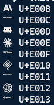

# CaskaydiaCove Nerd Font — Patched with AI Icons

This is an archived font from the Nerd Fonts release v3.4.0, extended with custom AI tool icons via `patch_all.py`.

For more information on Nerd Fonts see:
* https://github.com/ryanoasis/nerd-fonts/
* https://github.com/ryanoasis/nerd-fonts/releases/latest/

---

## About Cascadia Code

**Cascadia Code** is a fun, new monospaced font that includes programming ligatures.

For more information have a look at the upstream website: https://github.com/microsoft/cascadia-code

Note that upstream has a version with Nerd Font icons: CascadiaCodeNF. That has not been created with the Nerd Fonts `font-patcher`.

### Preprocessed Source Font

This source font has been preprocessed - it is not taken directly from upstream.
Cascadia Code is mainly a variable font (VF) and the static versions (that Nerd Fonts
are based on) are prepared in a different way: They have been hinted with `ttfautohint`.
That hints differ considerably from the hints in the VF. That changes the rendering for
smaller sizes (usual sizes in terminals) considerably.

To get the 'original' (i.e. VF) feel of the font we redo the hints in the static versions:
Open the font with Microsoft's VisualTrueType (VTT) and apply Light Latin Autohint.
The issue is known upstream and will probably be fixed. But until it is fixed we need
to do this manual process on all source updates.

Version: 2407.24

### Why `CaskaydiaCove` and not `Cascadia Code`?

The reason for the name change is to comply with the SIL Open Font License (OFL), in particular the [Reserved Font Name mechanism][SIL-RFN]:

> No Modified Version of the Font Software may use the Reserved Font
> Name(s) unless explicit written permission is granted by the corresponding
> Copyright Holder. This restriction only applies to the primary font name as
> presented to the users.

See the [Reserved Font Name section][SIL-RFN] for additional information.

---

## Which font variant should I use?

### TL;DR

* **`Nerd Font Mono`** — if your terminal is limited to monospaced fonts.
* **`Nerd Font`** — if you want larger icons (~1.5 character widths). Most terminals support this.
* **`Nerd Font Propo`** — for proportional contexts (GUI elements, presentations, etc).

### Ligatures

Ligatures are generally preserved in the patched fonts.
Nerd Fonts `v2.0.0` had no ligatures in the `Nerd Font Mono` fonts; this was dropped with `v2.1.0`.
If you have a ligature-aware terminal and don't want ligatures, you can usually disable them in the terminal settings.

### Getting the font

#### Option 1: Download already patched font

* Download a stable version from the [release page](https://github.com/ryanoasis/nerd-fonts/releases)
* Or download the development version from the folders here

#### Option 2: Patch your own font

* Patch your own variations with the options provided by the font patcher (e.g. exclude certain symbol sets to reduce file size)

For more information see: [The FAQ](https://github.com/ryanoasis/nerd-fonts/wiki/FAQ-and-Troubleshooting#which-font)

---

## AI Icons Patch (`patch_all.py`)

### What it does

`patch_all.py` takes the 36 TTF fonts in this directory and inserts 9 custom glyphs for **Anthropic**, **Claude**, **Claude Code**, **MCP**, and **OpenAI**. Each glyph is scaled to match the target font's UPM and centered vertically within the cell. The patched fonts are saved to `Patched/` with a `-Patched` suffix in both the filename and internal font metadata.

### Why

Nerd Fonts does not include icons for modern AI tools. This script adds them in the Unicode Private Use Area (`U+E00B`–`U+E013`), following the same convention used by the Nerd Fonts project, so they work anywhere a Nerd Font is supported — terminals, editors, status bars — with no plugins or images required.

### Preview



### Included glyphs

| Name | Codepoint |
|------|-----------|
| anthropic-icon | U+E00B |
| anthropic | U+E00C |
| claude-code | U+E00D |
| claude-icon | U+E00E |
| claude | U+E00F |
| mcp-icon | U+E010 |
| mcp | U+E011 |
| openai-icon | U+E012 |
| openai | U+E013 |

### Requirements

```
pip install fonttools
```

Edit the `devicons.ttf` path in `patch_all.py` if needed:

```python
DEVICONS_IN = r"C:\path\to\devicons.ttf"
```

### Usage

```powershell
python patch_all.py
```

Install the fonts from `Patched/` (right-click → **Install**), then verify the glyphs in Windows Terminal:

```powershell
0xE00B..0xE013 | ForEach-Object { "$([char]$_)  U+{0:X4}" -f $_ }
```

[SIL-RFN]:http://scripts.sil.org/cms/scripts/page.php?item_id=OFL_web_fonts_and_RFNs#14cbfd4a
